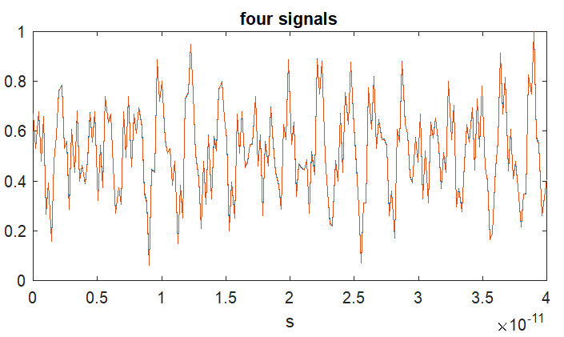
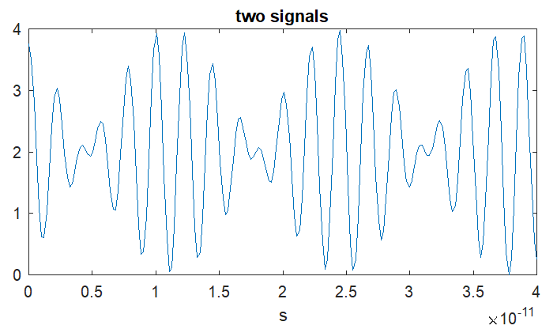
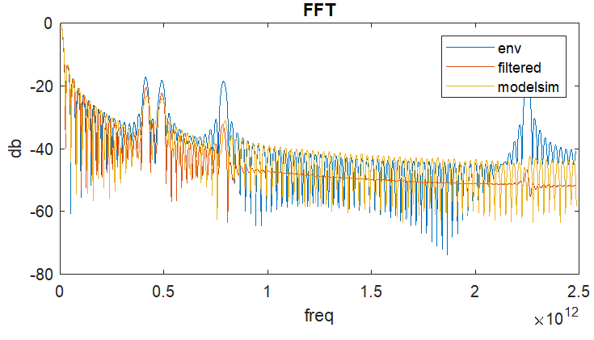
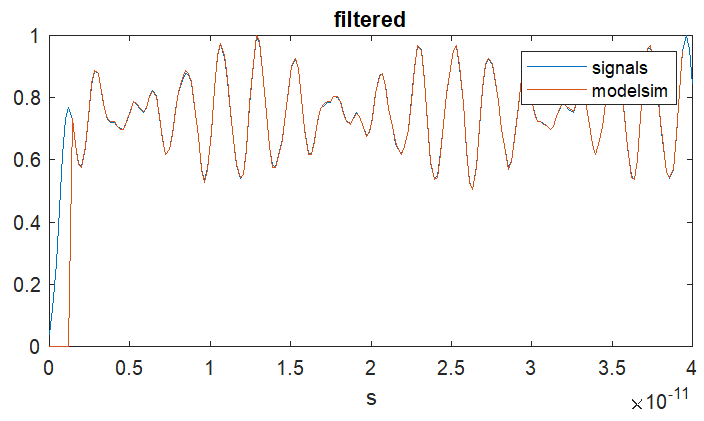

# Parallel FIR filter on VHDL
Filter coefficients calcuated in matlab. 
______
## Quick start
- Create project in Modelsim
- Add .vhdl files
- Compile All 
- Run do sim.do
- Run filter_design.m in Matlab
###### Output

